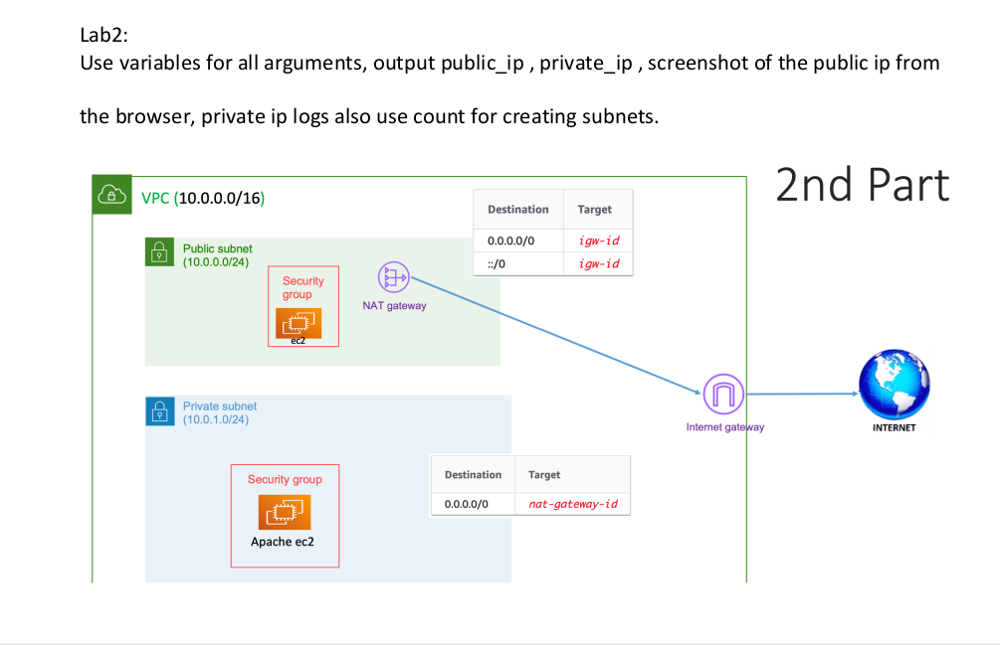

# Playing-With-Terraform

### Creating:

- VPC
- Public and Private Subnets
- NAT Getway
- Internet Getway
- Public and Private EC2s
- Security Groups for EC2s
- Route Tables
- variables.tf
- terraform.tfvars
- output.tf
- count for creating subnets

